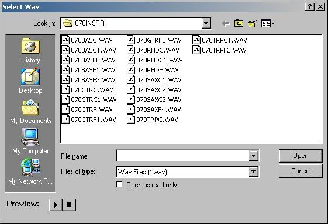



## Wav Dialog

### Description

Shows how to open a common dialog via API and add your own controls, subclass them and process the messages. This example creates to buttons on the OpenFile dialog to allow for previewing of a wav file.
 
### More Info
 

             |
---                |---
**Submitted On**   |2001-11-05 23:57:26
**By**             |[Shannon Harmon](https://github.com/Planet-Source-Code/PSCIndex/blob/master/ByAuthor/shannon-harmon.md)
**Level**          |Intermediate
**User Rating**    |4.7 (28 globes from 6 users)
**Compatibility**  |VB 5\.0, VB 6\.0
**Category**       |[Windows API Call/ Explanation](https://github.com/Planet-Source-Code/PSCIndex/blob/master/ByCategory/windows-api-call-explanation__1-39.md)
**World**          |[Visual Basic](https://github.com/Planet-Source-Code/PSCIndex/blob/master/ByWorld/visual-basic.md)
**Archive File**   |[Wav\_Dialog335171162001\.zip](https://github.com/Planet-Source-Code/shannon-harmon-wav-dialog__1-28665/archive/master.zip)

